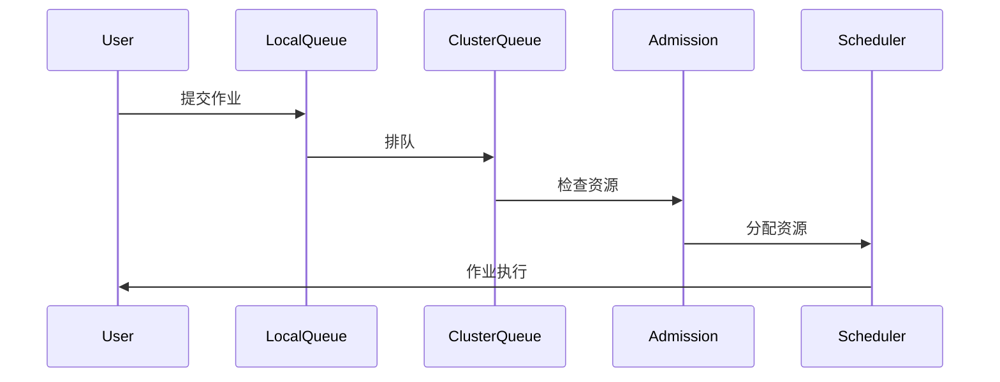
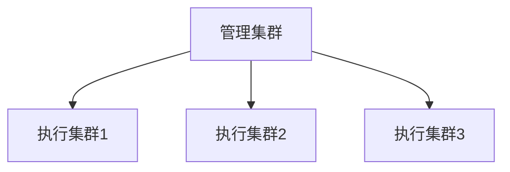
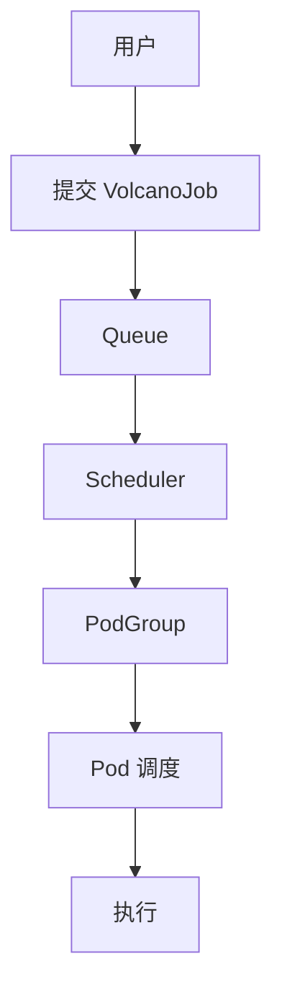
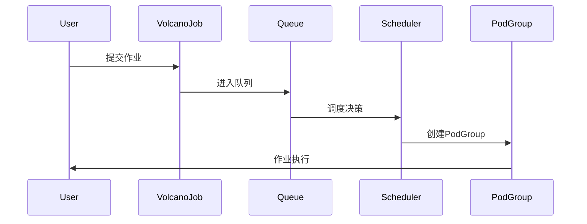
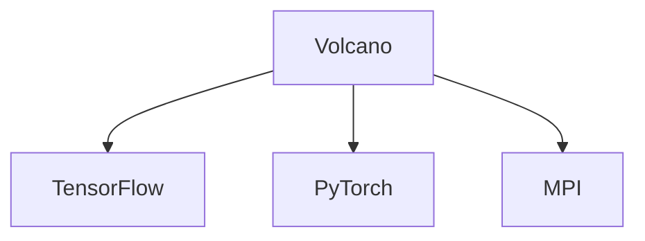

---
layout: intro
avatar: https://avatars.githubusercontent.com/u/13782141?v=4
title: 船长 @samzong
subtitle: 资深的云原生 及 AI 平台产品架构师与布道师
tags: 
  - "Cloud-Native"
  - "Kubernetes" 
  - "DevOps"
  - "LLMOps"
  - "AI Infra"
---

---
layout: toc
---

1.  **背景**: Kubernetes 批处理调度的挑战与演进
2.  **Kueue 深度解析**: 设计理念、核心架构与实战
3.  **Volcano 深度解析**: 设计理念、核心架构与实战
4.  **对比分析**: Kueue vs. Volcano
5.  **实战演示**: 任务入队、调度、执行全过程
6.  **总结与展望**

---
layout: chapter
part: 1
title: Kubernetes 原生调度
---
<!--
这里介绍下基础的 Kubernetes 的编排和调度的现状
-->
---
layout: default
title: Kubernetes 原生调度的局限性
---

`default-scheduler` 为通用场景设计，但在批处理领域力不从心：

- **Pod-by-Pod 调度**: 无法保证作业的 "All-or-Nothing"，导致资源死锁和浪费。
- **缺乏公平性**: 无法在多租户间实现公平的资源共享。
- **无队列概念**: 作业提交后立即竞争资源，高负载下导致集群混乱。
- **资源碎片化**: 频繁创建和销毁 Pod 导致资源利用率低下。

---
layout: default
title: 批处理调度的核心挑战
---

## 批处理调度的核心挑战

- **资源竞争**: 如何在多租户间公平分配资源？
- **优先级管理**: 如何确保关键作业优先执行？
- **资源利用率**: 如何减少碎片化，提升集群效率？
- **复杂依赖**: 如何处理作业间的依赖关系？
- **异构资源**: 如何支持 GPU、TPU 等特殊硬件？

---
layout: default
title: 批处理调度器的演进
---


- **2015-2017**: Kubernetes 初创，专注容器编排
- **2018-2020**: 批处理需求增加，社区探索解决方案
- **2021至今**: Kueue 和 Volcano 成为主流方案


---
layout: default
title: AI/ML 工作负载的需求
---

AI/ML 工作负载的需求

- **大规模并行**: 训练作业需要数百 GPU 同步工作
- **长周期作业**: 训练可能持续数周，需要稳定调度
- **资源弹性**: 需动态调整资源以应对峰值需求
- **故障恢复**: 需支持检查点和作业恢复

---
layout: chapter
part: 2
title: Kueue 深度解析
---
<!--
这里介绍下基础的 Kubernetes 的编排和调度的现状
-->

---
layout: default
title: Kueue 起源
---
- **发起**: Kubernetes SIG-Batch 工作组
- **目标**: 为批处理作业提供原生支持
- **时间线**:
  - 2021: 项目启动
  - 2022: 首个 alpha 版本
  - 2023: v0.5 发布，进入 beta
  - 2024: 接近 GA，广泛生产应用

---
layout: default
title: Kueue 设计理念
---

- **Job First**: 以作业为调度核心，而非单个 Pod
- **与原生协作**: 增强而非替代默认调度器
- **队列管理**: 通过队列实现资源排队和公平性
- **资源借用**: 动态借用和归还资源，提升利用率

---
layout: default
title: Kueue 核心架构
---

- **LocalQueue**: 租户级队列，组织作业
- **ClusterQueue**: 集群级资源池，定义资源边界
- **Workload**: 作业抽象，统一表示批处理任务

---
layout: default
title: Kueue 核心组件
---

- **Controller**: 协调作业生命周期
- **Admission Controller**: 决定作业是否进入执行
- **Scheduler**: 与 K8s 调度器协作分配资源
- **ResourceFlavor**: 定义异构资源类型

---
layout: default
title: Kueue 核心概念：Workload
---

- **定义**: 代表一个完整的批处理作业
- **包含**: 多个 Pod 模板和执行策略
- **生命周期**: 提交 -> 排队 -> 准入 -> 执行 -> 完成

```yaml
apiVersion: kueue.x-k8s.io/v1beta1
kind: Workload
metadata:
  name: sample-job
spec:
  queueName: user-queue
  podSets:
  - name: main
    replicas: 3
    template:
      spec:
        containers:
        - name: app
          image: busybox
```

---
layout: default
title: Kueue 核心概念：LocalQueue
---

- **作用**: 租户或团队的作业队列
- **特性**: 作业在 LocalQueue 中排队，等待资源
- **关联**: 绑定到一个 ClusterQueue

```yaml
apiVersion: kueue.x-k8s.io/v1beta1
kind: LocalQueue
metadata:
  name: team-a-queue
  namespace: team-a
spec:
  clusterQueue: cluster-queue-prod
```

---
layout: default
title: Kueue 核心概念：ClusterQueue
---

- **作用**: 定义集群级资源池和策略
- **特性**: 设置资源限制、借用策略和优先级
- **管理**: 跨租户资源分配

```yaml
apiVersion: kueue.x-k8s.io/v1beta1
kind: ClusterQueue
metadata:
  name: cluster-queue-prod
spec:
  namespaceSelector: {}
  resourceGroups:
  - coveredResources: ["cpu", "memory"]
    flavors:
    - name: default-flavor
      resources:
      - name: cpu
        nominalQuota: 10
      - name: memory
        nominalQuota: 10Gi
```

---
layout: default
title: Kueue 核心概念：ResourceFlavor
---

- **作用**: 抽象异构资源类型
- **场景**: 区分不同 GPU 型号或节点类型
- **配置**: 为资源池指定可用资源类型

```yaml
apiVersion: kueue.x-k8s.io/v1beta1
kind: ResourceFlavor
metadata:
  name: gpu-a100
spec:
  nodeLabels:
    gpu-type: nvidia-a100
```

---
layout: default
title: Kueue 调度流程
---



---
layout: default
title: Kueue 特性：资源借用与回收
---

- **借用**: 当资源不足时，可临时借用其他队列资源
- **回收**: 作业完成后，归还借用资源
- **策略**: 通过 `lendingLimit` 控制借用上限

```yaml
spec:
  resourceGroups:
  - coveredResources: ["cpu"]
    flavors:
    - name: default
      resources:
      - name: cpu
        nominalQuota: 10
        lendingLimit: 5
```

---
layout: default
title: Kueue 特性：公平性与优先级
---

- **公平性**: 基于资源使用量动态调整优先级
- **优先级**: 高优先级作业可抢占低优先级作业
- **配置**: 通过 `WorkloadPriorityClass` 定义

```yaml
apiVersion: kueue.x-k8s.io/v1beta1
kind: WorkloadPriorityClass
metadata:
  name: high-priority
value: 1000
```

---
layout: default
title: Kueue 特性：MultiKueue (新)
---


- **目标**: 跨集群作业调度
- **架构**: 中心化管理集群 + 多个执行集群
- **场景**: 大规模分布式训练



---
layout: default
title: Kueue 优势
---

- **原生集成**: 与 Kubernetes API 无缝协作
- **轻量级**: 仅增强调度，不替代核心组件
- **灵活性**: 支持多种资源类型和策略
- **社区支持**: Kubernetes 官方项目

---
layout: default
title: Kueue 适用场景
---

- **AI/ML 训练**: 动态分配 GPU 资源
- **大数据处理**: 批量作业管理
- **CI/CD 流水线**: 资源受限环境下的任务排队
- **多租户集群**: 资源公平分配

---
layout: chapter
part: 2
title: Volcano 深度解析
---
<!--
这里介绍下基础的 Kubernetes 的编排和调度的现状
-->

---
layout: default
title: Volcano 起源
---

- **发起**: 华为，2019年开源
- **目标**: 高性能计算(HPC)和批处理调度
- **时间线**:
  - 2019: 初始版本发布
  - 2021: v1.0，功能成熟
  - 2024: v1.8+，支持更多场景

---
layout: default
title: Volcano 设计理念
---

- **HPC 优先**: 借鉴传统高性能计算调度
- **自定义调度器**: 完全控制调度逻辑
- **批处理优化**: 支持复杂作业依赖和资源管理
- **插件化**: 易于扩展功能

---
layout: default
title: Volcano 核心架构
---



- **VolcanoJob**: 自定义作业类型
- **Queue**: 作业队列
- **PodGroup**: 作业内 Pod 集合

---
layout: default
title: Volcano 核心组件
---

- **vc-scheduler**: 核心调度器
- **vc-controller**: 管理作业生命周期
- **vc-gang**: 实现组调度
- **插件**: 支持扩展功能

---
layout: default
title: Volcano 核心概念：VolcanoJob
---

- **定义**: 自定义作业资源
- **特性**: 支持并行度、依赖关系

```yaml
apiVersion: batch.volcano.sh/v1alpha1
kind: Job
metadata:
  name: volcano-job
spec:
  minAvailable: 3
  tasks:
  - replicas: 3
    name: task1
    template:
      spec:
        containers:
        - name: app
          image: busybox
```

---
layout: default
title: Volcano 核心概念：PodGroup
---


- **作用**: 将作业的 Pod 组织为一个调度单位
- **特性**: 确保组内 Pod 满足最小可用数才调度

```yaml
apiVersion: scheduling.volcano.sh/v1beta1
kind: PodGroup
metadata:
  name: pod-group
spec:
  minMember: 3
```

---
layout: default
title: Volcano 核心概念：Queue
---

- **作用**: 作业排队和资源分配单位
- **特性**: 支持权重、优先级

```yaml
apiVersion: scheduling.volcano.sh/v1beta1
kind: Queue
metadata:
  name: high-priority-queue
spec:
  weight: 10
```

---
layout: default
title: Volcano 调度流程
---



---
layout: default
title: Volcano 特性：Gang Scheduling
---

- **定义**: 组调度，确保作业满足最小 Pod 数才执行
- **优势**: 避免资源死锁

```yaml
spec:
  minAvailable: 5
```

---
layout: default
title: Volcano 特性：作业依赖
---

- **作用**: 定义作业间依赖关系
- **场景**: 数据处理流水线

```yaml
spec:
  policies:
  - event: TaskCompleted
    action: Enqueue
    condition:
      taskName: preprocess
```

---
layout: default
title: Volcano 特性：AI/ML 生态集成
---

- **支持**: TensorFlow, PyTorch, MPI
- **优化**: 分布式训练调度
- **案例**: 华为云 AI 平台



---
layout: default
title: Volcano 优势
---

- **高性能**: 针对 HPC 和 AI 优化
- **功能丰富**: 支持复杂作业依赖
- **自定义性**: 可完全替代默认调度器
- **生态集成**: 与 AI 框架深度结合

---
layout: default
title: Volcano 适用场景
---

- **大规模 AI 训练**: 分布式训练优化
- **HPC 工作负载**: 科学计算
- **复杂批处理**: 作业依赖管理
- **资源密集型应用**: 高资源利用率

---
layout: chapter
part: 4
title: 对比分析：Kueue vs. Volcano
---
<!--
这里介绍下基础的 Kubernetes 的编排和调度的现状
-->

---
layout: default
title:  设计理念对比
---

| 维度          | Kueue                          | Volcano                       |
|--------------|-------------------------------|------------------------------|
| **设计目标**  | 增强 K8s 原生调度             | 替代默认调度器，HPC 优先     |
| **集成方式**  | 与默认调度器协作              | 独立调度器                   |
| **核心关注**  | Job 级队列管理               | 复杂批处理和高性能计算        |

---
layout: default
title:  功能特性对比
---

| 特性          | Kueue                          | Volcano                       |
|--------------|-------------------------------|------------------------------|
| **队列管理**  | LocalQueue + ClusterQueue     | Queue                       |
| **组调度**    | 通过 Workload 实现            | Gang Scheduling (PodGroup)  |
| **资源借用**  | 支持动态借用与回收            | 通过队列权重分配            |
| **作业依赖**  | 基础支持                      | 强大，支持复杂依赖          |
| **AI 优化**   | 通用支持                      | 深度集成 TF, PyTorch 等     |
| **多集群**    | MultiKueue (实验性)           | 暂无原生支持                |

---
layout: default
title: 性能对比
---

- **调度速度**:
  - Kueue: 依赖默认调度器，速度中等
  - Volcano: 自定义调度器，速度更快
- **资源利用率**:
  - Kueue: 通过借用机制提升利用率
  - Volcano: 通过组调度减少碎片
- **大规模作业**:
  - Kueue: 适合中小规模
  - Volcano: 更适合大规模 HPC

---
layout: default
title: 适用场景对比
---

| 场景                | Kueue 推荐度          | Volcano 推荐度        |
|--------------------|----------------------|----------------------|
| **AI/ML 训练**     | 中等 (通用场景)      | 高 (大规模分布式)    |
| **大数据批处理**   | 高 (多租户公平性)    | 中等 (依赖复杂性)    |
| **CI/CD 流水线**   | 高 (轻量级集成)      | 低 (过于重型)        |
| **HPC 科学计算**   | 低 (功能不足)        | 高 (性能优化)        |

---
layout: default
title: 选型建议
---

- **选择 Kueue 如果**:
  - 需要与 Kubernetes 原生深度集成
  - 关注多租户资源公平性
  - 作业规模中等，偏通用场景
- **选择 Volcano 如果**:
  - 需要高性能计算和 AI 优化
  - 作业依赖复杂
  - 需要完全控制调度逻辑

---
layout: chapter
part: 5
title: 实战演练
---
<!--
这里介绍下基础的 Kubernetes 的编排和调度的现状
-->

---
layout: default
title: 环境准备
---

- **集群**: Kubernetes v1.25+
- **工具**: kubectl, kueuectl, volcano cli
- **安装 Kueue**:
  ```bash
  kubectl apply -f https://github.com/kubernetes-sigs/kueue/releases/download/v0.5.0/manifests.yaml
  ```
- **安装 Volcano**:
  ```bash
  kubectl apply -f https://github.com/volcano-sh/volcano/releases/download/v1.8.0/volcano.yaml
  ```

---
layout: default
title: Kueue 实战：配置 ClusterQueue
---

```yaml
apiVersion: kueue.x-k8s.io/v1beta1
kind: ClusterQueue
metadata:
  name: ai-training-queue
spec:
  namespaceSelector: {}
  resourceGroups:
  - coveredResources: ["cpu", "memory", "nvidia.com/gpu"]
    flavors:
    - name: gpu-flavor
      resources:
      - name: cpu
        nominalQuota: 16
      - name: memory
        nominalQuota: 32Gi
      - name: nvidia.com/gpu
        nominalQuota: 4
        lendingLimit: 2
```

---
layout: default
title: Kueue 实战：提交作业
---

```yaml
apiVersion: batch/v1
kind: Job
metadata:
  name: ai-training-job
  annotations:
    kueue.x-k8s.io/queue-name: ai-team-queue
spec:
  template:
    spec:
      containers:
      - name: trainer
        image: tensorflow/tensorflow:2.12.0-gpu
        resources:
          limits:
            nvidia.com/gpu: 2
      restartPolicy: OnFailure
```

---
layout: default
title: Kueue 实战：监控调度
---

- **查看队列状态**:
  ```bash
  kueuectl list localqueue -n ai-team
  ```
- **查看作业状态**:
  ```bash
  kubectl get workload -n ai-team
  ```
- **资源借用情况**:
  ```bash
  kubectl describe clusterqueue ai-training-queue
  ```

---
layout: default
title: Kueue 实战：故障排查
---

- **作业卡在排队**:
  - 检查 ClusterQueue 资源是否耗尽
  - 查看是否有更高优先级作业抢占
- **资源借用失败**:
  - 检查 lendingLimit 是否过低
  - 确认是否有其他队列可用资源

---
layout: default
title: Volcano 实战：配置 Queue
---

```yaml
apiVersion: scheduling.volcano.sh/v1beta1
kind: Queue
metadata:
  name: ai-training-queue
spec:
  weight: 10
  capability:
    cpu: 16
    memory: 32Gi
    nvidia.com/gpu: 4
```

---
layout: default
title: Volcano 实战：提交 VolcanoJob
---

```yaml
apiVersion: batch.volcano.sh/v1alpha1
kind: Job
metadata:
  name: distributed-training
spec:
  minAvailable: 4
  tasks:
  - replicas: 4
    name: trainer
    template:
      spec:
        containers:
        - name: tf-trainer
          image: tensorflow/tensorflow:2.12.0-gpu
          resources:
            limits:
              nvidia.com/gpu: 1
        restartPolicy: OnFailure
```

---
layout: default
title: Volcano 实战：监控调度
---

- **查看队列**:
  ```bash
  kubectl get queue -n volcano-system
  ```
- **查看作业**:
  ```bash
  kubectl get job -n ai-team
  ```
- **查看 PodGroup**:
  ```bash
  kubectl get podgroup -n ai-team
  ```

---
layout: default
title: Volcano 实战：故障排查
---

- **作业未调度**:
  - 检查 Queue 资源配额
  - 确认 minAvailable 是否满足
- **PodGroup 卡住**:
  - 查看是否有节点资源碎片
  - 检查是否有更高优先级作业

---
layout: default
title: 性能优化案例
---

- **Kueue**:
  - 调整 lendingLimit 提高资源利用率
  - 使用 WorkloadPriorityClass 优化关键作业
- **Volcano**:
  - 调整 Queue 权重平衡多团队需求
  - 使用 Gang Scheduling 减少资源死锁

---
layout: chapter
part: 6
title:  总结与展望
---

---
layout: default
title: 核心总结
---

- **Kueue**: Kubernetes 原生增强，适合多租户和通用批处理
- **Volcano**: 高性能计算优化，适合 AI/HPC 和复杂依赖
- **选型关键**: 根据工作负载特性和集成需求选择

---
layout: default
title: 未来展望
---

- **Kueue**: MultiKueue 成熟，多集群调度成为标配
- **Volcano**: 进一步优化 AI 生态集成
- **社区趋势**: 两种方案可能功能融合，统一批处理标准

---
layout: default
title: 案例分享
---

## 生产环境部署

可扩展性（大型集群）
高可用性（HA 配置）
监控与日志（Prometheus）
生产环境调试

---
layout: intro
title: Q&A 与讨论
---

- 您的集群批处理痛点是什么？
- Kueue 和 Volcano 哪个更适合您的场景？
- 实战中遇到过哪些调度问题？

---
layout: intro
---
<h1 style="font-size: 64px !important" >
感谢聆听！
</h1>

<p style="font-size: 32px !important">
https://github.com/samzong
</p>