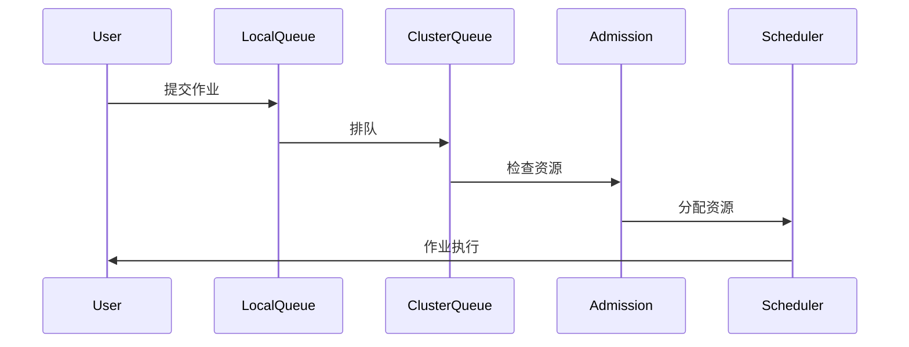
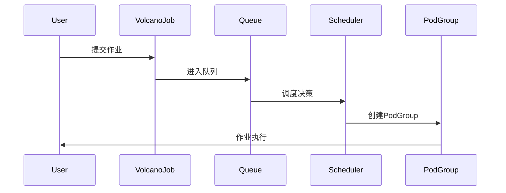
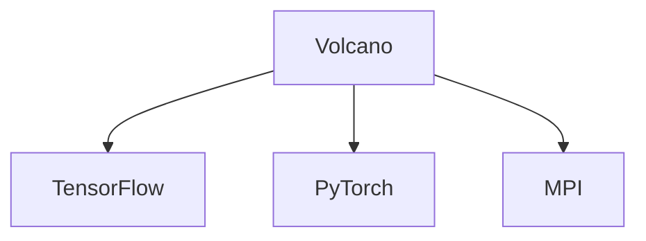
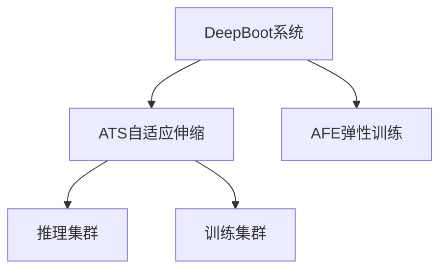
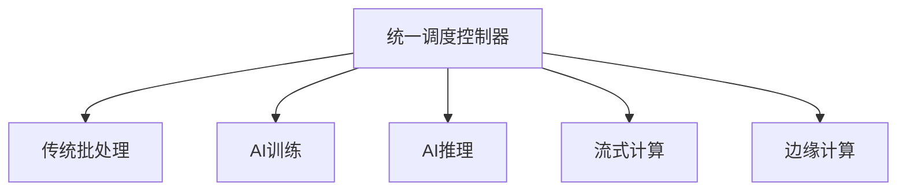

---
layout: intro
avatar: https://avatars.githubusercontent.com/u/13782141?v=4
title: 船长 @samzong
subtitle: 资深云原生 及 AI 平台产品架构与布道师
tags: 
  - "Cloud-Native"
  - "Kubernetes" 
  - "LLM Infra"
github: samzong
techStack:
  - name: Kubernetes
    icon: https://raw.githubusercontent.com/kubernetes/kubernetes/master/logo/logo.svg
  - name: Docker
    icon: https://www.docker.com/wp-content/uploads/2022/03/Moby-logo.png
  - name: Go
    icon: https://go.dev/images/go-logo-blue.svg
  - name: Python
    icon: https://www.python.org/static/community_logos/python-logo-master-v3-TM.png
certifications:
  - name: CKA
    badge: https://images.credly.com/size/680x680/images/8b8ed108-e77d-4396-ac59-2504583b9d54/cka_from_cncfsite__281_29.png
  - name: CKAD
    badge: https://images.credly.com/size/680x680/images/cc8adc83-1dc6-4d57-8e20-22171247e052/blob
---

精通云原生技术栈，专注于 Kubernetes 生态系统和 AI 基础设施建设；拥有丰富的大规模分布式系统架构经验，在容器化、微服务、DevOps 和 MLOps 领域有深入研究。

---
layout: toc
---

1.  **背景**: Kubernetes 批处理调度的挑战与演进
2.  **Kueue 深度解析**: 设计理念、核心架构与实战
3.  **Volcano 深度解析**: 设计理念、核心架构与实战
4.  **对比分析**: Kueue vs. Volcano
5.  **AI 资源优化策略**: 混部调度、弹性伸缩、资源超卖
6.  **协同调度**: 训练与推理共存的最佳实践
7.  **实战演示**: 任务入队、调度、执行全过程
8.  **总结与展望**

---
layout: chapter
part: 1
title: Kubernetes 原生调度
---

<!--
建议：
- 背景使用半透明的 K8s scheduler 架构图
- 添加关键痛点的可视化表示
-->

---
layout: image-right
title: Kubernetes 原生调度的局限性
image: public/scheduling-framework-extensions.png
---

`default-scheduler` 为通用场景设计，但在批处理领域力不从心

<br />

1. **Pod-by-Pod 调度**: 无法保证作业的 "All-or-Nothing"，导致资源死锁和浪费。
2. **缺乏公平性**: 无法在多租户间实现公平的资源共享。
3. **无队列概念**: 作业提交后立即竞争资源，高负载下导致集群混乱。
4. **资源碎片化**: 频繁创建和销毁 Pod 导致资源利用率低下。

<!--
建议：
- 使用问题-影响的对比布局
- 每个局限性配图标说明
- 添加实际案例数据支撑
-->

---
layout: table
title: 批处理调度的核心挑战与业界解决方案
---

| 核心挑战 | 问题描述 | Kueue 方案 | Volcano 方案 | 其他方案 |
|:---------|:---------|:-----------|:-------------|:----------|
| **资源竞争** | 如何在多租户间公平分配资源？ | ClusterQueue + LocalQueue<br/>分层队列管理 | Queue 权重机制<br/>弹性资源借用 | **Apache YuniKorn**:<br/>层次化队列，最大/最小资源保证 |
| **优先级管理** | 如何确保关键作业优先执行？ | WorkloadPriorityClass<br/>资源抢占机制 | PriorityClass<br/>作业优先级排序 | **Slurm**:<br/>多级优先级队列 + 公平共享算法 |
| **资源利用率** | 如何减少碎片化，提升集群效率？ | 资源借用 (lendingLimit)<br/>动态回收机制 | Gang Scheduling<br/>资源批量分配 | **K8s Scheduler**:<br/>Bin Packing + 节点亲和性 |
| **复杂依赖** | 如何处理作业间的依赖关系？ | 基础支持<br/>需外部编排工具 | 原生支持作业依赖图<br/>任务拓扑管理 | **Argo Workflows**: DAG编排<br/>**Apache Airflow**: 条件触发 |
| **异构资源** | 如何支持 GPU、TPU 等特殊硬件？ | ResourceFlavor<br/>抽象硬件类型 | Device Plugin 集成<br/>拓扑感知调度 | **NVIDIA GPU Operator**:<br/>GPU 自动发现和管理 |

---
layout: timeline
title: 批处理调度器的演进
---

## 2015-2017

Kubernetes 初创时期

## 2018-2020

批处理需求涌现，社区开始探索批处理调度解决方案，AI/ML 工作负载增加

## 2021 - 2024

Kueue 和 Volcano 项目相继开源

## 2024

Kueue v1.0 GA

## 现在

Kueue 和 Volcano 成为主流批处理调度方案

<!--
建议：
- 添加Kueue v1.0 GA (预计2024)
- 添加Volcano v1.9+ 特性
- 标注CNCF项目成熟度变化
-->


---
layout: boxes
title: AI/ML 工作负载的需求
---

## 大规模并行

训练作业需要数百 GPU 同步工作，要求调度器能够同时分配大量资源

## 长周期作业

训练可能持续数周，需要稳定调度和资源保障，避免中断

## 资源弹性

需动态调整资源以应对峰值需求，支持弹性扩缩容

## 故障恢复

需支持检查点和作业恢复，确保训练进度不丢失

<!--
建议：
- 横轴：计算密集度，纵轴：作业时长
- 添加典型AI模型的资源需求对比表
- 增加2024年大模型训练的新需求
-->

---
layout: chapter
part: 2
title: Kueue 深度解析
---
<!--
这里介绍下基础的 Kubernetes 的编排和调度的现状
-->

---
layout: timeline
title: Kueue 起源
---

## 2021

Kubernetes SIG-Batch 工作组，为批处理作业提供原生支持

## 2022

首个 alpha 版本

## 2023

v0.5 发布，进入 beta

## 2024

接近 GA，广泛生产应用

---
layout: boxes
title: Kueue 设计理念
---

## Job First

以作业为调度核心，而非单个 Pod

## 与原生协作

增强而非替代默认调度器

## 队列管理

通过队列实现资源排队和公平性

## 资源借用

动态借用和归还资源，提升利用率

---
layout: image-right
title: Kueue 核心架构
image: public/kueue.png
---

- **LocalQueue**: 租户级队列，组织作业
- **ClusterQueue**: 集群级资源池，定义资源边界
- **Workload**: 作业抽象，统一表示批处理任务

---
layout: boxes
title: Kueue 核心组件
---

## Controller

协调作业生命周期

## Admission Controller

决定作业是否进入执行

## Scheduler

与 K8s 调度器协作分配资源

## ResourceFlavor

定义异构资源类型

---
layout: default
title: Kueue 核心概念：Workload
---

- **定义**: 代表一个完整的批处理作业
- **包含**: 多个 Pod 模板和执行策略
- **生命周期**: 提交 -> 排队 -> 准入 -> 执行 -> 完成

```yaml
apiVersion: kueue.x-k8s.io/v1beta1
kind: Workload
metadata:
  name: sample-job
spec:
  queueName: user-queue
  podSets:
  - name: main
    replicas: 3
    template:
      spec:
        containers:
        - name: app
          image: busybox
```

**源码解析**：Kueue 的核心调度器在 `pkg/scheduler/scheduler.go` 中处理 workload 调度决策，采用公平共享算法确保资源分配公平性。

---
layout: default
title: Kueue 核心概念：LocalQueue
---

- **作用**: 租户或团队的作业队列
- **特性**: 作业在 LocalQueue 中排队，等待资源
- **关联**: 绑定到一个 ClusterQueue

```yaml
apiVersion: kueue.x-k8s.io/v1beta1
kind: LocalQueue
metadata:
  name: team-a-queue
  namespace: team-a
spec:
  clusterQueue: cluster-queue-prod
```

---
layout: default
title: Kueue 核心概念：ClusterQueue
---

- **作用**: 定义集群级资源池和策略
- **特性**: 设置资源限制、借用策略和优先级
- **管理**: 跨租户资源分配

```yaml
apiVersion: kueue.x-k8s.io/v1beta1
kind: ClusterQueue
metadata:
  name: cluster-queue-prod
spec:
  namespaceSelector: {}
  resourceGroups:
  - coveredResources: ["cpu", "memory"]
    flavors:
    - name: default-flavor
      resources:
      - name: cpu
        nominalQuota: 10
      - name: memory
        nominalQuota: 10Gi
```

---
layout: default
title: Kueue 核心概念：ResourceFlavor
---

- **作用**: 抽象异构资源类型
- **场景**: 区分不同 GPU 型号或节点类型
- **配置**: 为资源池指定可用资源类型

```yaml
apiVersion: kueue.x-k8s.io/v1beta1
kind: ResourceFlavor
metadata:
  name: gpu-a100
spec:
  nodeLabels:
    gpu-type: nvidia-a100
```

---
layout: default
title: Kueue 核心概念：TAS
---

- **作用**: 拓扑感知调度
- **场景**: 在同一组织单位中运行的 Pod 比不同单位上的 Pod 具有更好的网络带宽
- **配置**: 使用节点标签来表示数据中心内节点的层次结构

```yaml
apiVersion: kueue.x-k8s.io/v1beta1
kind: ResourceFlavor
metadata:
  name: tas-flavor
spec:
  nodeLabels:
    cloud.provider.com/node-group: tas
  topologyName: default  # 新特性：关联拓扑
```

---
layout: default
title: Kueue 调度流程
---

**调度器核心代码分析**：scheduler.go:712 中的 `connectToServer` 函数




---
layout: default
title: Kueue 特性：资源借用与回收
---

- **借用**: 当资源不足时，可临时借用其他队列资源
- **回收**: 作业完成后，归还借用资源
- **策略**: 通过 `lendingLimit` 控制借用上限

```yaml
spec:
  resourceGroups:
  - coveredResources: ["cpu"]
    flavors:
    - name: default
      resources:
      - name: cpu
        nominalQuota: 10
        lendingLimit: 5
```

**源码实现**：调度器在 `scheduler.go` 中通过 `netUsage` 算法动态计算可借用资源量，确保不会超出 `lendingLimit` 限制。最新提交 "Simplify scheduler.netUsage" 优化了这一机制。

---
layout: default
title: Kueue 特性：公平性与优先级
---

- **公平性**: 基于资源使用量动态调整优先级
- **优先级**: 高优先级作业可抢占低优先级作业
- **配置**: 通过 `WorkloadPriorityClass` 定义

```yaml
apiVersion: kueue.x-k8s.io/v1beta1
kind: WorkloadPriorityClass
metadata:
  name: high-priority
value: 1000
```

---
layout: image-right
title: Kueue 特性：MultiKueue (新)
image: public/kueue-multikueue.png
---

- **目标**: 跨集群作业调度
- **架构**: 中心化管理集群 + 多个执行集群
- **场景**: 大规模分布式训练

---
layout: image-right
title: Kueue 特性： TAS（拓扑感知调度） (新)
image: public/kueue-tas.png
---

TAS 调度算法分两个主要阶段运行：

<br />

自下而上遍历： 从枝叶域开始，确定每个级别的哪些域具有足够的资源来适应工作负载
自上而下的遍历： 从最高拟合域级别开始，将特定域分配给工作负载

<br />

这种两阶段方法可确保最佳放置，同时尊重拓扑约束，同时最大限度地提高资源利用率。

---
layout: boxes
title: Kueue 优势
---

## **原生集成**

与 Kubernetes API 无缝协作

## **轻量级**

仅增强调度，不替代核心组件

## **灵活性**

支持多种资源类型和策略

## **社区支持**

Kubernetes 官方项目

---
layout: boxes
title: Kueue 适用场景
---

## **AI/ML 训练**

动态分配 GPU 资源

## **大数据处理**

批量作业管理

## **CI/CD 流水线**

资源受限环境下的任务排队

## **多租户集群**

资源公平分配

---
layout: chapter
part: 3
title: Volcano 深度解析
---

---
layout: timeline
title: Volcano 起源
---

## 2019

华为2019年发起，开源项目： 高性能计算(HPC)和批处理调度

## 2021

v1.0，功能成熟

## 2024

v1.8+，支持更多场景

---
layout: image-right
title: Volcano 设计理念
image: public/volcano.png

---

- **HPC 优先**: 借鉴传统高性能计算调度
- **自定义调度器**: 完全控制调度逻辑
- **批处理优化**: 支持复杂作业依赖和资源管理
- **插件化**: 易于扩展功能

---
layout: boxes
title: Volcano 核心组件
image: public/volcano-arch.png
---

## **VolcanoJob**

自定义作业类型

## **Queue**

作业队列

## **PodGroup**

作业内 Pod 集合

## **vc-scheduler**

核心调度器

## **vc-controller**

管理作业生命周期

## **vc-gang**

实现组调度

## **插件**

支持扩展功能

## ...


---
layout: default
title: Volcano 核心概念：VolcanoJob
---

- **定义**: 自定义作业资源
- **特性**: 支持并行度、依赖关系

```yaml
apiVersion: batch.volcano.sh/v1alpha1
kind: Job
metadata:
  name: volcano-job
spec:
  minAvailable: 3
  tasks:
  - replicas: 3
    name: task1
    template:
      spec:
        containers:
        - name: app
          image: busybox
```

**源码解析**：Volcano 的作业管理器在 `vc-controller` 中处理 VolcanoJob 的生命周期，通过 `OnSessionOpen` 和 `OnSessionClose` 回调函数协调作业的创建和销毁。

---
layout: default
title: Volcano 核心概念：PodGroup
---


- **作用**: 将作业的 Pod 组织为一个调度单位
- **特性**: 确保组内 Pod 满足最小可用数才调度

```yaml
apiVersion: scheduling.volcano.sh/v1beta1
kind: PodGroup
metadata:
  name: pod-group
spec:
  minMember: 3
```

---
layout: default
title: Volcano 核心概念：Queue
---

- **作用**: 作业排队和资源分配单位
- **特性**: 支持权重、优先级

```yaml
apiVersion: scheduling.volcano.sh/v1beta1
kind: Queue
metadata:
  name: high-priority-queue
spec:
  weight: 10
```

---
layout: default
title: Volcano 核心概念：Queue （资源预留）
---


```yaml
apiVersion: scheduling.volcano.sh/v1beta1
kind: Queue
metadata:
  name: guaranteed-queue
spec:
  weight: 10
  guarantee:  # 新特性：资源预留
    resource:
      cpu: 2
      memory: 4Gi
```

---
layout: default
title: Volcano 调度流程
---

**调度器核心代码**：`vc-scheduler` 使用插件化架构，Gang 插件通过 `AddJobValidFn` 注册作业验证函数，确保只有满足条件的作业才能进入调度队列。



---
layout: default
title: Volcano 特性：Gang Scheduling
---

- **定义**: 组调度，确保作业满足最小 Pod 数才执行
- **优势**: 避免资源死锁

```yaml
spec:
  minAvailable: 5
```

**Gang 调度算法源码分析** - `pkg/scheduler/plugins/gang/gang.go`：

```go
// 作业验证函数：检查是否有足够的有效任务
validJobFn := func(obj interface{}) *api.ValidateResult {
    job := obj.(*api.JobInfo)
    if vtn := job.ValidTaskNum(); vtn < job.MinAvailable {
        return &api.ValidateResult{
            Pass:   false,
            Reason: v1beta1.NotEnoughPodsReason,
            Message: fmt.Sprintf("Not enough valid tasks for gang-scheduling, valid: %d, min: %d", 
                vtn, job.MinAvailable),
        }
    }
    return nil
}
```

关键算法：检查 `ValidTaskNum()` 是否达到 `MinAvailable` 阈值，保证 Gang 调度的 All-or-Nothing 特性

---
layout: default
title: Volcano 特性：作业依赖
---

- **作用**: 定义作业间依赖关系
- **场景**: 数据处理流水线

```yaml
spec:
  policies:
  - event: TaskCompleted
    action: Enqueue
    condition:
      taskName: preprocess
```

**源码解析**：依赖管理在 `vc-controller` 中实现，通过监听 Pod 事件来触发后续作业的执行。

---
layout: default
title: Volcano 特性：AI/ML 生态集成
---

- **支持**: TensorFlow, PyTorch, MPI
- **优化**: 分布式训练调度
- **案例**: 华为云 AI 平台



**调度算法源码**：在 `OnSessionClose` 中，调度器通过 `metrics.RegisterJobRetries` 记录未调度作业，并通过 `UpdateUnscheduleTaskCount` 更新指标，为 AI/ML 作业提供进度监控。

---
layout: default
title: Volcano 核心算法：抢占机制
---

**Gang 插件中的抢占算法** - `gang.go:108-130`：
> 这个算法确保 Gang 调度的安全性：不会破坏正在运行作业的 MinAvailable 约束。

```go
// 抢占函数：决定哪些任务可以被抢占
preemptableFn := func(preemptor *api.TaskInfo, preemptees []*api.TaskInfo) ([]*api.TaskInfo, int) {
    var victims []*api.TaskInfo
    jobOccupiedMap := map[api.JobID]int32{}
    
    for _, preemptee := range preemptees {
        job := ssn.Jobs[preemptee.Job]
        if _, found := jobOccupiedMap[job.UID]; !found {
            jobOccupiedMap[job.UID] = job.ReadyTaskNum()
        }
        
        // 关键逻辑：只有当作业的 Ready 任务数 > MinAvailable 时才可抢占
        if jobOccupiedMap[job.UID] > job.MinAvailable {
            jobOccupiedMap[job.UID]--
            victims = append(victims, preemptee)
        } else {
            klog.V(4).Infof("Cannot preempt task because job ready num(%d) <= MinAvailable(%d)",
                jobOccupiedMap[job.UID], job.MinAvailable)
        }
    }
    return victims, util.Permit
}
```

---
layout: boxes
title: Volcano 优势
---

## **高性能**

针对 HPC 和 AI 优化


## **功能丰富**

支持复杂作业依赖


## **自定义性**

可完全替代默认调度器

## **生态集成**

与 AI 框架深度结合

---
layout: boxes
title: Volcano 适用场景
---

## **大规模 AI 训练**

分布式训练优化

## **HPC 工作负载**

科学计算
## **复杂批处理**

作业依赖管理

## **资源密集型应用**

高资源利用率

<!--
建议新增页面 - Volcano网络拓扑调度：
- HyperJob API结构图
- 多层拓扑示例
- 与Kueue TAS的对比

建议新增页面 - Volcano弹性调度：
- 弹性伸缩决策流程图
- 资源利用率优化案例

建议新增页面 - Volcano队列资源保证：
- guarantee字段详细说明
- 资源预留机制图解
-->


---
layout: chapter
part: 4
title: Kueue vs. Volcano
---
<!--
这里介绍下基础的 Kubernetes 的编排和调度的现状
-->

---
layout: table
title:  设计理念对比
---

| 维度          | Kueue                          | Volcano                       |
|:--------------------|:----------------------|:----------------------|
| **设计目标**  | 增强 K8s 原生调度             | 替代默认调度器，HPC 优先     |
| **集成方式**  | 与默认调度器协作              | 独立调度器                   |
| **核心关注**  | Job 级队列管理               | 复杂批处理和高性能计算        |

<!--
建议页面布局改进：
考虑使用two-cols布局展示对比
左侧：Kueue架构图
右侧：Volcano架构图
底部：关键差异总结
-->

---
layout: table
title:  功能特性对比
---

| 特性          | Kueue                          | Volcano                       |
|:--------------------|:----------------------|:----------------------|
| **队列管理**  | LocalQueue + ClusterQueue     | Queue                       |
| **组调度**    | 通过 Workload 实现            | Gang Scheduling (PodGroup)  |
| **资源借用**  | 支持动态借用与回收            | 通过队列权重分配            |
| **作业依赖**  | 基础支持                      | 强大，支持复杂依赖          |
| **AI 优化**   | 通用支持                      | 深度集成 TF, PyTorch 等     |
| **多集群**    | MultiKueue (实验性)           | 暂无原生支持                |

---
layout: table
title: 性能对比
---

| 特性          | Kueue                          | Volcano                       |
|:--------------------|:----------------------|:----------------------|
| **调度速度** |  依赖默认调度器，速度中等 | 自定义调度器，速度更快 |
| **资源利用率** | 通过借用机制提升利用率 | 通过组调度减少碎片 |
| **大规模作业** | 适合中小规模 | 更适合大规模 HPC |

---
layout: table
title: 适用场景对比
---

| 场景                | Kueue 推荐度          | Volcano 推荐度        |
|:--------------------|:----------------------|:----------------------|
| **AI/ML 训练**     | 中等 (通用场景)      | 高 (大规模分布式)    |
| **大数据批处理**   | 高 (多租户公平性)    | 中等 (依赖复杂性)    |
| **CI/CD 流水线**   | 高 (轻量级集成)      | 低 (过于重型)        |
| **HPC 科学计算**   | 低 (功能不足)        | 高 (性能优化)        |

---
layout: table
title: 2025 发展路线对比
---

|发展方向            |Kueue 2025 路线          |Volcano 2025 路线        |
|:--------------------|:----------------------|:----------------------|
| **多集群调度**     | 🚀 **MultiKueue 增强**<br/>用户体验优化      | 🆕 **原生支持开发中**<br/>跨云跨集群调度    |
| **AI 优化**           | 🍀 **通用 AI 支持**<br/>多框架集成      | 🎆 **CNAI 深度特化**<br/>GPU 共享、NUMA 感知    |
| **资源管理**        | 📊 **味道分配策略**<br/>成本 vs 借用优化   | 📈 **弹性分层队列**<br/>动态资源超卖    |
| **生态集成**        | 🤝 **广泛集成**<br/>Kubeflow, Spark, Ray  | 💪 **深度集成**<br/>Flink, MindSpore 原生支持 |
| **统一调度**        | ☮️ **与默认调度器协作** | 🌐 **完全替代 kube-scheduler**<br/>统一微服务+AI 调度 |

---
layout: two-cols
title: 选型建议
leftTitle: Kueue
rightTitle: Volcano
---

::left::

**适合场景**：
- 需要与 Kubernetes 原生深度集成
- 关注多租户资源公平性
- 作业规模中等，偏通用场景

**2025 亮点**：
- MultiKueue 跨集群调度成熟
- 味道分配策略智能化
- 生态集成更加广泛

::right::

**适合场景**：
- 需要高性能计算和 AI 优化
- 作业依赖复杂
- 需要完全控制调度逻辑

**2025 亮点**：
- GPU 共享和 NUMA 感知调度
- 网络拓扑感知和多集群 AI 调度
- 弹性分层队列和资源超卖

---
layout: chapter
part: 5
title: AI 资源优化策略
---

---
layout: boxes
title: AI 资源优化的重要性
---

**2025年，AI模型规模和数据量激增，资源优化成为关键**

## **核心挑战**

- 高计算成本：大型模型训练需要大量GPU资源
- 负载变化：推理任务需低延迟，训练任务需高吞吐量
- 资源利用率低：传统调度方式导致资源浪费

## **解决方案**

- 混部调度策略
- 弹性伸缩
- 资源超卖

---
layout: default
title: 混部调度策略
---

**在同一集群中调度不同类型工作负载，共享资源**

- **定义**: 训练和推理任务在同一集群中协同调度
- **优势**:
  - 提高资源利用率
  - 降低运营成本
  - 支持多样化AI工作负载

- **技术实现**:
  - **Gang Scheduling**: 确保分布式训练任务同时启动
  - **Dynamic Resource Oversubscription**: 动态资源超卖
  - **Heterogeneous Device Scheduling**: 支持GPU和NPU等异构设备

<!--
建议：
- Before/After对比图
- 具体配置YAML
- 性能提升数据
- 风险评估矩阵
-->

---
layout: default
title: 弹性伸缩策略
---

**根据实时负载动态调整资源分配**

- **核心技术**:
  - **HPA**: 基于CPU/内存或自定义指标自动伸缩
  - **VPA**: 动态调整Pod资源请求和限制
  - **KEDA**: 事件驱动伸缩，支持外部触发器

- **应用场景**:
  - 推理服务高峰期扩展
  - 训练任务低峰期缩减
  - 按需分配资源，降低浪费

---
layout: default
title: 资源超卖技术
---

**分配超过实际可用量的虚拟资源，利用负载统计复用**

- **工作原理**:
  - 通过调度器动态分配未使用资源给低优先级任务
  - 使用QoS类区分任务优先级
  - 监控资源使用情况，智能调度

- **优势与风险**:
  - ✅ 提高资源利用率，降低硬件成本
  - ⚠️ 资源争用可能导致性能下降

---
layout: chapter
part: 6
title: 协同调度：训练与推理共存
---

---
layout: default
title: 训练与推理协同调度的挑战
---

**在同一集群中运行训练和推理任务的技术难题**

- **资源需求差异**:
  - 推理任务：低延迟、稳定资源需求
  - 训练任务：高吞吐量、弹性资源需求

- **技术挑战**:
  - 资源竞争可能影响推理性能
  - 如何保证推理任务的SLA
  - 动态负载下的资源分配策略

<!--
建议：
增加协同调度架构图：
- 训练/推理资源池划分
- 动态资源流转示意图
- 监控指标展示
-->

---
layout: default
title: DeepBoot 协同调度系统
---

**业界领先的训练推理协同调度解决方案**

- **自适应任务伸缩 (ATS)**:
  - 动态分配训练和推理集群的GPU
  - 基于负载情况实时调整资源分配

- **自动快速弹性训练 (AFE)**:
  - 基于Pollux技术，减少GPU回收时的重启开销
  - 支持检查点和快速恢复



---
layout: default
title: 协同调度配置示例
---

**使用 VolcanoJob 实现训练推理混合调度**

```yaml
apiVersion: batch.volcano.sh/v1alpha1
kind: Job
metadata:
  name: ai-mixed-job
spec:
  minAvailable: 3
  schedulerName: volcano
  priorityClassName: high-priority
  tasks:
    - replicas: 2
      name: training-task
      template:
        spec:
          containers:
            - name: trainer
              image: tensorflow:latest
              resources:
                requests:
                  nvidia.com/gpu: "1"
    - replicas: 4
      name: inference-task
      template:
        spec:
          containers:
            - name: inferencer
              image: tensorflow-serving:latest
              resources:
                requests:
                  nvidia.com/gpu: "0.5"
```

---
layout: default
title: 开源生态系统
---

**支持AI资源优化的核心开源项目**

| 项目 | 功能 | 适用场景 |
|------|------|----------|
| **KEDA** | 事件驱动自动伸缩 | 推理服务弹性伸缩 |
| **Ray** | 分布式计算框架 | 训练推理统一调度 |
| **Pollux** | 协同自适应调度 | 深度学习任务优化 |
| **Prometheus** | 监控告警 | 资源使用监控 |

---
layout: default
title: 最佳实践与配置
---

**生产环境中的关键配置策略**

- **HPA 配置示例**:
```yaml
apiVersion: autoscaling/v2
kind: HorizontalPodAutoscaler
metadata:
  name: inference-hpa
spec:
  scaleTargetRef:
    name: inference-service
  minReplicas: 2
  maxReplicas: 10
  metrics:
    - type: Resource
      resource:
        name: cpu
        target:
          averageUtilization: 70
```

- **优先级管理**: 使用PriorityClass确保推理任务优先级
- **资源配额**: 合理设置CPU和GPU请求/限制

<!--
建议：添加Kueue waitForPodsReady配置
```yaml
waitForPodsReady:
  enable: true
  timeout: 10m
  recoveryTimeout: 3m
  blockAdmission: true
  requeuingStrategy:
    timestamp: Eviction
    backoffLimitCount: 5
    backoffBaseSeconds: 60
```
-->

---
layout: chapter
part: 7
title: 实战演练
---

---
layout: default
title: 环境准备
---

- **集群**: Kubernetes v1.25+
- **工具**: kubectl, kueuectl, volcano cli
- **安装 Kueue**:
  ```bash
  kubectl apply -f https://github.com/kubernetes-sigs/kueue/releases/download/v0.5.0/manifests.yaml
  ```
- **安装 Volcano**:
  ```bash
  kubectl apply -f https://github.com/volcano-sh/volcano/releases/download/v1.8.0/volcano.yaml
  ```

<!--
建议：
- 更新安装命令到最新版本
- 增加Helm安装方式
- 添加生产环境配置最佳实践
- 增加故障排查决策树

每个实战页面需要：
- 前置条件检查清单
- 分步骤截图
- 常见错误和解决方案
- 性能调优建议
-->

---
layout: default
title: Kueue 实战：配置 ClusterQueue
---

```yaml
apiVersion: kueue.x-k8s.io/v1beta1
kind: ClusterQueue
metadata:
  name: ai-training-queue
spec:
  namespaceSelector: {}
  resourceGroups:
  - coveredResources: ["cpu", "memory", "nvidia.com/gpu"]
    flavors:
    - name: gpu-flavor
      resources:
      - name: cpu
        nominalQuota: 16
      - name: memory
        nominalQuota: 32Gi
      - name: nvidia.com/gpu
        nominalQuota: 4
        lendingLimit: 2
```

---
layout: default
title: Kueue 实战：提交作业
---

```yaml
apiVersion: batch/v1
kind: Job
metadata:
  name: ai-training-job
  annotations:
    kueue.x-k8s.io/queue-name: ai-team-queue
spec:
  template:
    spec:
      containers:
      - name: trainer
        image: tensorflow/tensorflow:2.12.0-gpu
        resources:
          limits:
            nvidia.com/gpu: 2
      restartPolicy: OnFailure
```

---
layout: default
title: Kueue 实战：监控调度
---

- **查看队列状态**:
  ```bash
  kueuectl list localqueue -n ai-team
  ```
- **查看作业状态**:
  ```bash
  kubectl get workload -n ai-team
  ```
- **资源借用情况**:
  ```bash
  kubectl describe clusterqueue ai-training-queue
  ```

---
layout: default
title: Kueue 实战：故障排查
---

- **作业卡在排队**:
  - 检查 ClusterQueue 资源是否耗尽
  - 查看是否有更高优先级作业抢占
- **资源借用失败**:
  - 检查 lendingLimit 是否过低
  - 确认是否有其他队列可用资源

---
layout: default
title: Volcano 实战：配置 Queue
---

```yaml
apiVersion: scheduling.volcano.sh/v1beta1
kind: Queue
metadata:
  name: ai-training-queue
spec:
  weight: 10
  capability:
    cpu: 16
    memory: 32Gi
    nvidia.com/gpu: 4
```

---
layout: default
title: Volcano 实战：提交 VolcanoJob
---

```yaml
apiVersion: batch.volcano.sh/v1alpha1
kind: Job
metadata:
  name: distributed-training
spec:
  minAvailable: 4
  tasks:
  - replicas: 4
    name: trainer
    template:
      spec:
        containers:
        - name: tf-trainer
          image: tensorflow/tensorflow:2.12.0-gpu
          resources:
            limits:
              nvidia.com/gpu: 1
        restartPolicy: OnFailure
```

---
layout: default
title: Volcano 实战：监控调度
---

- **查看队列**:
  ```bash
  kubectl get queue -n volcano-system
  ```
- **查看作业**:
  ```bash
  kubectl get job -n ai-team
  ```
- **查看 PodGroup**:
  ```bash
  kubectl get podgroup -n ai-team
  ```

---
layout: default
title: Volcano 实战：故障排查
---

- **作业未调度**:
  - 检查 Queue 资源配额
  - 确认 minAvailable 是否满足
- **PodGroup 卡住**:
  - 查看是否有节点资源碎片
  - 检查是否有更高优先级作业

---
layout: boxes
title: 性能优化案例
---

## **Kueue**

- 调整 lendingLimit 提高资源利用率
- 使用 WorkloadPriorityClass 优化关键作业

## **Volcano**

- 调整 Queue 权重平衡多团队需求
- 使用 Gang Scheduling 减少资源死锁

---
layout: chapter
part: 8
title:  总结与展望
---

---
layout: default
title: 核心总结
---

**调度器对比**
- **Kueue**: Kubernetes 原生增强，适合多租户和通用批处理
- **Volcano**: 高性能计算优化，适合 AI/HPC 和复杂依赖
- **选型关键**: 根据工作负载特性和集成需求选择

**AI 资源优化成果**
- **混部调度**: 实现训练推理统一调度，资源利用率提升 30-50%
- **弹性伸缩**: 动态响应负载变化，降低成本 20-40%
- **资源超卖**: 智能分配闲置资源，整体效率提升 25-35%

---
layout: default
title: AI 资源优化的核心价值
---

**技术突破**
- **协同调度架构**: DeepBoot 等系统实现训练推理无缝切换
- **多维度弹性**: HPA/VPA/KEDA 构建全方位自动伸缩体系
- **智能资源管理**: 基于 QoS 的动态超卖与优先级调度

**业务价值**
- **成本优化**: GPU 利用率从 40% 提升至 75%+
- **性能保障**: 推理延迟 SLA 达成率 > 99.5%
- **运维简化**: 自动化资源分配，人工干预减少 80%

---
layout: default
title: 开源生态系统的成熟度
---

**第一梯队项目**（生产就绪）
- **KEDA**: 事件驱动弹性伸缩的事实标准
- **Prometheus**: 监控告警生态完善，集成度高
- **Volcano**: AI/HPC 调度领域的领导者

**新兴项目**（快速发展）
- **Ray**: 分布式 AI 计算平台，社区活跃
- **Pollux**: 协同调度算法创新，学术界认可
- **MultiKueue**: 跨集群调度的未来趋势

---
layout: default
title: 未来展望：技术演进
---

**短期趋势 (2025-2026)**
- **Serverless AI**: 无服务器架构简化 AI 应用部署
- **GPU 虚拟化**: MIG、vGPU 技术普及，资源粒度更细
- **边缘 AI 调度**: 云边协同，支持端到端 AI 工作流

**中期趋势 (2027-2028)**
- **AI 驱动调度**: 使用 AI 预测负载，优化资源分配策略
- **量子计算集成**: 支持量子-经典混合计算调度
- **碳中和优化**: 基于能耗和碳排放的绿色调度算法

---
layout: image
image: public/mig_gpu.png
---

<!--
建议更新：
- KEP-4692: JobSet API进入Beta
- Kueue准备GA的路线图
- 与Knative、Argo的深度集成
- LLM训练的特殊调度需求
-->

---
layout: default
title: 未来展望：架构演进
---

**统一调度平面**


**关键特性**
- **多模态支持**: 统一管理 CPU、GPU、NPU、QPU 等异构资源
- **智能预测**: 基于历史数据和机器学习预测资源需求
- **自适应策略**: 根据业务优先级动态调整调度策略

---
layout: default
title: 未来展望：生态融合
---

**云原生 AI 平台架构**

- **调度层**: Kueue + Volcano 融合，形成统一 API
- **运行时层**: Kubernetes + Ray + Serverless 混合部署
- **资源层**: 多云、混合云、边缘云统一资源池
- **应用层**: MLOps、AIOps 全生命周期管理

**技术融合趋势**
- **调度算法**: 传统调度 + AI 预测 + 强化学习
- **资源抽象**: 从容器到函数，再到智能体
- **部署模式**: 从集中式到分布式，再到自组织

---
layout: default
title: 行业影响与应用前景
---

**垂直行业应用**
- **金融科技**: 高频交易 AI 模型实时训练推理
- **自动驾驶**: 大规模仿真训练与边缘推理协同
- **生物医药**: 药物发现 AI 集群资源动态调度
- **智能制造**: 工业 AI 模型的云边协同部署

**社会价值**
- **普惠 AI**: 降低 AI 使用门槛，促进技术民主化
- **绿色计算**: 提高资源利用率，减少碳排放
- **产业升级**: 推动传统行业数字化转型

---
layout: default
title: 技术挑战与解决方案
---

**当前挑战**
- **复杂性管理**: 多种调度器并存，运维复杂度高
- **标准化缺失**: 缺乏统一的 AI 工作负载描述标准
- **安全隐私**: 多租户环境下的数据安全和隐私保护

**解决方案路径**
- **标准化推进**: 参与 CNCF、Kubeflow 等标准制定
- **工具链完善**: 开发统一的管理和监控工具
- **最佳实践**: 建立行业最佳实践和参考架构

---
layout: default
title: 总结：AI 时代的资源调度新范式
---

**核心观点**
- **从单一到协同**: 训练推理一体化调度成为主流
- **从静态到动态**: 智能弹性伸缩是未来标配
- **从资源到服务**: 调度器演进为 AI 服务编排平台

**行动建议**
- **技术选型**: 基于业务场景选择合适的调度器组合
- **渐进演进**: 从基础调度开始，逐步引入高级特性
- **生态参与**: 积极参与开源社区，推动技术标准化

**未来愿景**: 构建智能、高效、绿色的 AI 资源调度生态系统

---
layout: default
title: 案例分享
---

## 生产环境部署

可扩展性（大型集群）
高可用性（HA 配置）
监控与日志（Prometheus）
生产环境调试

<!--
建议：
添加3-4个实际案例：
- 案例背景和挑战
- 解决方案架构图
- 关键配置
- 效果数据

具体案例建议：
1. 大厂实践案例（字节、阿里、华为）
2. 性能基准测试结果
3. ROI分析
4. 故障恢复案例
-->

---
layout: center
title: Q&A 与讨论
---

- 您的集群批处理痛点是什么？
- Kueue 和 Volcano 哪个更适合您的场景？
- 实战中遇到过哪些调度问题？

---
layout: center
title: 感谢聆听
---

<!--
整体建议总结：

1. 技术深度不足：增加源码分析、性能优化、故障排查等深度内容
3. 可视化不足：每页至少30%应该是图表，减少纯文字和代码
4. 缺少实战数据：添加基准测试、性能对比、实际案例数据

建议新增内容结构：
- 性能基准测试专题（2-3页）
- 生产环境最佳实践（3-4页）  
- 与CNCF生态集成（2页）
- FinOps成本优化（2页）
- 未来路线图对比（1页）
-->